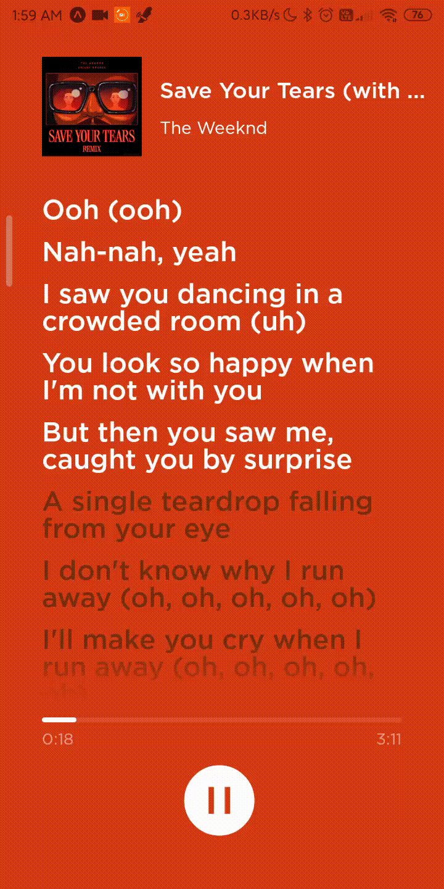

# Spotify Synced Lyrics using Reanimated 2

I made the Spotify Synced Lyrics Screen using Reanimated 2. I first tried to make the project using Animated API from React Native but I was not able to achieve the Auto Scroll part. And no, it doesn't play the music that would be a huge copyright issue.

All the components are made using Reanimated 2. Previously I was using Animated from React Native but it was very limited and code was becoming messy. This is my first project based on Animation, _it may not be much but its an honest work_.

<p align="center">

</p>
<details>
  <summary>Disclaimer</summary>
All the assets (Album art, lyrics, fonts etc) are copyright of their respective owners. This project is purely made for educational use.

Song Used in this example is "_Save Your Tears (with Ariana Grande) (Remix)_" by [The Weeknd](https://open.spotify.com/artist/1Xyo4u8uXC1ZmMpatF05PJ) and [Ariana Grande](https://open.spotify.com/artist/66CXWjxzNUsdJxJ2JdwvnR). [Listen it on Spotify](https://open.spotify.com/track/37BZB0z9T8Xu7U3e65qxFy)

Download Spotify from [here](https://www.spotify.com/us/download/)

Follow [The Weeknd](https://twitter.com/theweeknd) and [Ariana Grande](https://twitter.com/ArianaGrande?s=20)

</details>

### Libraries Used :

This is an expo managed project. You can read about expo [here](https://docs.expo.io/).

- `react-native-reanimated` (duh!) : Used for animations
- `expo-linear-gradient` : For the gradient effect on the edges on lyrics component.
- `expo` and `typescript`

Special thanks to [eveningkid](https://twitter.com/eveningkid) for inspiring me. Check out his channel on [Youtube](https://www.youtube.com/channel/UC8_DvNte5Jj9zhzJ5kg04MA)

To run the app on your phone or emulator, first make sure you have installed `expo-cli`. Then

```
# Install Dependencies
yarn
# or do "npm install"

# Start expo project
yarn run start
# or npm run start

```

## Found a Bug? / Want to Help?

If you found a bug in my code or any optimisation problem please open an issue. I would love to fix my code.

If you want to help, this project is accepting contributions. Just fork and open PR, I will gladly merge it. You can start by looking at Todos mentioned below.

## Todo

- [ ] Make the Lyrics Part Scrollable by User
- [ ] Make the whole Player Part
